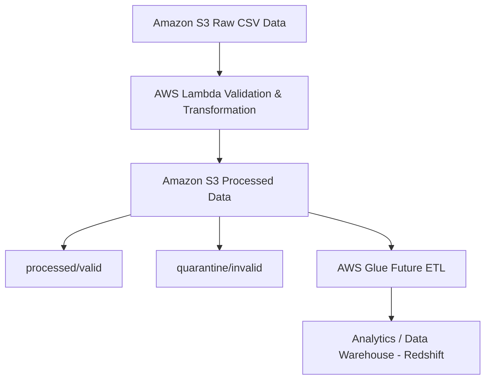

## Serverless Data Processing Pipeline using AWS Lambda, S3 and SAM
# Project Overview
This project implements an event-driven serverless data processing pipeline using AWS services.

When a CSV file containing order data is uploaded to Amazon S3, an AWS Lambda function is automatically triggered. The Lambda function performs data validation and transformation, then stores the processed output into structured S3 folders for downstream batch processing.

The infrastructure is deployed using AWS SAM (Serverless Application Model) enabling Infrastructure as Code (IaC).

## Architecture

## Problem Statement

Organizations often receive large volumes of raw data that may contain:

- Duplicate records
- Invalid numeric values
- Missing fields
- Incorrect data formats

Manually cleaning this data is inefficient and error-prone.

This project implements a serverless automated pipeline that:

- Automatically processes uploaded CSV files
- Validates and cleans incoming data
- Separates valid and invalid records
- Stores structured data for further analytics processing

## Tech Stack

- AWS Lambda – Serverless compute for data processing
- Amazon S3 – Data ingestion and storage
- AWS SAM – Infrastructure as Code
- AWS CloudFormation – Infrastructure provisioning
- AWS Glue (Planned) – Batch ETL processing
- Python – Data validation and transformation
- Docker – Local Lambda testing
- GitHub Actions – CI/CD pipeline automation

## Features

# Event-Driven Processing
Files uploaded to S3 automatically trigger a Lambda function.

# Data Validation
The pipeline validates:
Duplicate order_id
Numeric values for amount
Positive transaction values
Missing or invalid fields

# Data Transformation
Valid records are transformed:
Convert numeric fields to proper types
Normalize product names
Clean whitespace from fields
Standardize schema

# Data Segregation
Output data is stored in separate S3 folders:
processed/
   valid/
quarantine/
   invalid/
# Local Development & Testing
Developers can run Lambda locally using AWS SAM CLI.

## CI/CD Pipeline (GitHub Actions)

This project uses GitHub Actions for automated CI/CD deployment.

Whenever code is pushed to the main branch, the pipeline automatically builds and deploys the Lambda application using AWS SAM.

## CI/CD Workflow

1. Developer pushes code to the GitHub repository
2. GitHub Actions workflow is triggered
3. AWS SAM build process runs
4. AWS SAM deploy updates the infrastructure
5. AWS CloudFormation provisions or updates resources
6. AWS Lambda function is updated

# Workflow Steps

The CI/CD pipeline performs the following steps:

Checkout repository

Setup Python environment

Install AWS SAM CLI

Configure AWS credentials using GitHub Secrets

Build application using sam build

Deploy infrastructure using sam deploy

The workflow configuration is stored in:
 - .github/workflows/deploy.yml

## Deployment

# Build the application
- sam build --use-container
# Deploy the application
- sam deploy --guided

# Local Testing

Invoke Lambda locally using an S3 event:

- sam local invoke -e events/event.json

You can also simulate API calls using:

- sam local start-api

## Example Data Flow

# Raw Input
raw_data/raw_orders.csv

Example record:

order_id,customer_name,email,order_date,amount,product,quantity,city
1005,Amit Kumar,amit@gmail.com,23-02-2025,700,Mouse,1,Chennai

# Processed Output

Valid records:

- processed/valid/orders_2026_03_06.csv

Invalid records:

- quarantine/invalid/orders_2026_03_06.csv

## Key Learnings

Through this project, I learned:

- Designing event-driven serverless architectures
- Using AWS SAM for Infrastructure as Code
- Implementing data validation pipelines
- Handling S3 event triggers
- Writing production-ready Lambda functions
- Running Lambda locally using Docker
- Automating deployments with GitHub Actions (CI/CD)

## Future Enhancements (Data Engineering Upgrade)

This project will be extended into a complete data engineering pipeline:

- Convert processed data to Parquet format for efficient storage and querying
- Partition data to optimize AWS Athena query performance
- Integrate AWS Glue ETL jobs for large-scale data processing
- Implement a Data Lake architecture (Bronze / Silver / Gold layers)
- Add automated data quality monitoring and validation checks
- Integrate AWS Athena for analytics and ad-hoc queries

## Why This Project Matters

This project demonstrates key Data Engineering concepts:

- Event-driven data ingestion
- Serverless architecture
- Data validation pipelines
- Cloud-native ETL design
- Infrastructure as Code (IaC)
- CI/CD automation
