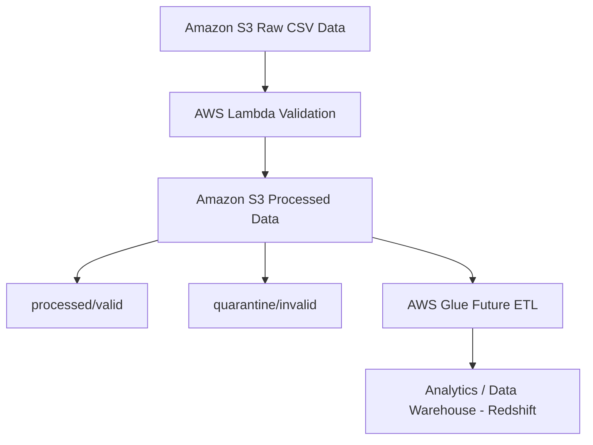

# Serverless Data Processing Pipeline (AWS Lambda + S3 + SAM)

## Overview

This project implements an **event-driven serverless data processing pipeline** using AWS services.

When a CSV file containing order data is uploaded to **Amazon S3**, an **AWS Lambda function** is automatically triggered to validate and process the data. Valid and invalid records are separated and stored in structured S3 folders for downstream analytics and ETL pipelines.

Infrastructure is deployed using **AWS SAM (Serverless Application Model)** enabling **Infrastructure as Code (IaC)**.

---

# Architecture


```mermaid
flowchart TD
    A[Amazon S3 Raw CSV Data] --> B[AWS Lambda Validation]
    B --> C[Amazon S3 Processed Data]

    C --> D[processed/valid]
    C --> E[quarantine/invalid]

    C --> F[AWS Glue Future ETL]
    F --> G[Analytics / Data Warehouse - Redshift]
```

### Architecture Explanation

1. Raw CSV files are uploaded to **Amazon S3**
2. S3 triggers an **AWS Lambda function**
3. Lambda validates incoming records
4. Valid records are stored in `processed/valid`
5. Invalid records are stored in `quarantine/invalid`
6. Clean data becomes available for downstream **ETL pipelines and analytics**

---

# Problem Statement

Organizations often receive large volumes of raw data that may contain:

- Duplicate records
- Invalid numeric values
- Missing fields
- Incorrect data formats

Manually cleaning this data is inefficient and error-prone.

This project implements an automated **serverless validation pipeline** that processes data immediately when files arrive.

---

# Key Features

### Event-Driven Processing
Files uploaded to S3 automatically trigger the Lambda function.

### Data Validation

The pipeline validates:

- Duplicate `order_id`
- Numeric values for `amount`
- Positive transaction values
- Missing or invalid fields

### Data Segregation

Output data is stored in separate S3 folders:

```
processed/
   valid/

quarantine/
   invalid/
```

### Infrastructure as Code

Infrastructure is deployed using **AWS SAM**, enabling reproducible deployments.

### Local Development

Developers can run Lambda locally using **AWS SAM CLI and Docker**.

---

# Tech Stack

| Technology | Purpose |
|---|---|
| AWS Lambda | Serverless compute for data processing |
| Amazon S3 | Data ingestion and storage |
| AWS SAM | Infrastructure as Code |
| AWS CloudFormation | Infrastructure provisioning |
| Python | Data validation and transformation |
| Docker | Local Lambda testing |
| GitHub Actions | CI/CD automation |
| AWS Glue (Future) | Batch ETL processing |

---

# Project Structure

```
lambda-s3-data-validation-pipeline
│
├── .github/
│   └── workflows/
│       └── deploy.yml            # CI/CD pipeline for SAM deployment
│
├── events/
│   └── event.json                # Sample S3 event for local testing
│
├── hello_world/
│   ├── __init__.py
│   ├── app.py                    # Lambda entry point
│   ├── validation.py             # Data validation logic
│   └── requirements.txt          # Python dependencies
│
├── tests/
│   ├── integration/
│   │   ├── __init__.py
│   │   └── test_api_gateway.py
│   │
│   └── unit/
│       ├── __init__.py
│       ├── test_handler.py
│       └── requirements.txt
│
├── template.yaml                 # AWS SAM infrastructure template
├── samconfig.toml                # SAM deployment configuration
├── README.md
└── .gitignore
```

---

# Example Data Flow

### Raw Input

```
raw_data/raw_orders.csv
```

Example record

```
order_id,customer_name,email,order_date,amount,product,quantity,city
1005,Amit Kumar,amit@gmail.com,23-02-2025,700,Mouse,1,Chennai
```

### Processed Output

Valid records

```
processed/valid/orders_2026_03_06.csv
```

Invalid records

```
quarantine/invalid/orders_2026_03_06.csv
```

---

# CI/CD Pipeline (GitHub Actions)

This project uses **GitHub Actions** for automated CI/CD deployment.

Whenever code is pushed to the `main` branch:

1. GitHub Actions workflow is triggered
2. AWS SAM build process runs
3. AWS SAM deploy updates the infrastructure
4. AWS CloudFormation provisions or updates resources
5. AWS Lambda function is updated

Workflow file:

```
.github/workflows/deploy.yml
```

---

# Deployment

Build the application

```
sam build --use-container
```

Deploy infrastructure

```
sam deploy --guided
```

---

# Local Testing

Invoke Lambda locally using an S3 event:

```
sam local invoke -e events/event.json
```

Start local API simulation:

```
sam local start-api
```

---

# Testing

Run unit tests

```
pytest tests/unit
```

Run integration tests

```
pytest tests/integration
```

---

# Key Learnings

Through this project I gained hands-on experience with:

- Designing **event-driven serverless architectures**
- Implementing **data validation pipelines**
- Using **AWS SAM for Infrastructure as Code**
- Handling **S3 event triggers**
- Writing production-ready **AWS Lambda functions**
- Running Lambda locally using **Docker**
- Automating deployments with **GitHub Actions**

---

# Roadmap (Future Enhancements)

This project will be extended into a complete **Data Engineering pipeline**:

- Convert processed data to **Parquet format**
- Partition data for **Athena query optimization**
- Integrate **AWS Glue ETL jobs**
- Implement **Data Lake architecture (Bronze / Silver / Gold layers)**
- Add automated **data quality monitoring**
- Integrate **AWS Athena for analytics queries**

---

# Author

**R Sreenath**

AWS Data Engineer

GitHub  
https://github.com/Sreenathravindra

LinkedIn  
https://www.linkedin.com/in/r-sreenath-9190b2256
